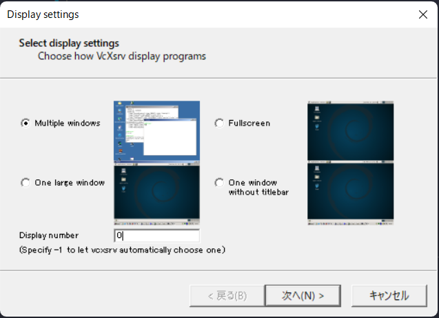
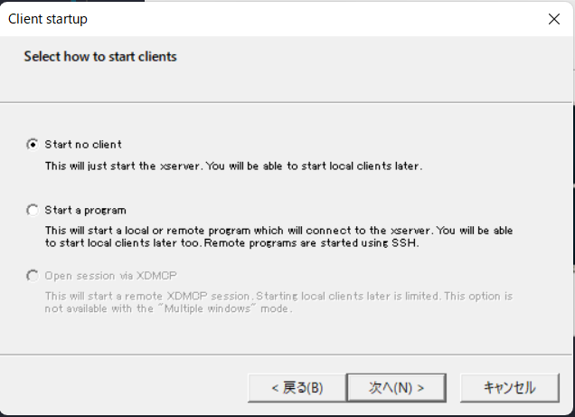
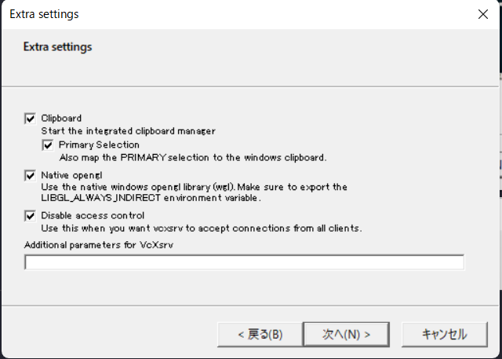
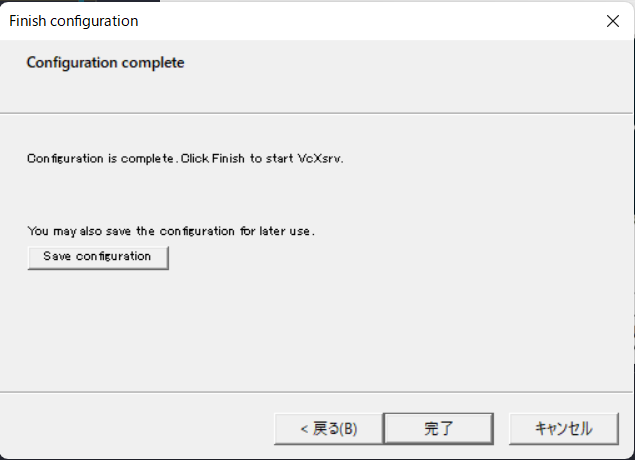

# PythonSandbox
Python virtual environment with Docker

## Environment
Windows  
[Docker Desktop for Windows](https://hub.docker.com/editions/community/docker-ce-desktop-windows/)  
[Visual Stdio Code](https://azure.microsoft.com/ja-jp/products/visual-studio-code/)  
[VcXsrv](https://sourceforge.net/projects/vcxsrv/)  

## Python version
3.9.6

## Requirements
matplotlib  
numpy  
seaborn  
pandas  
flake8  
autopep8  
pytest  

## How to use
### 1. Launch VcXsrv
execute xlaunch.exe  
  
  
  
  

### 2. Open root directory with VSCode
