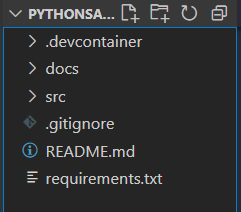
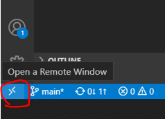
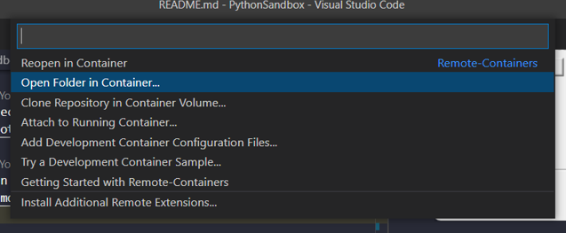
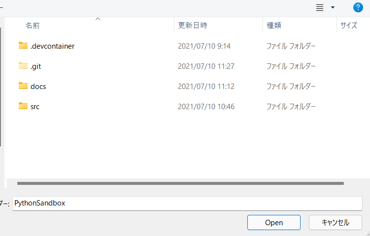
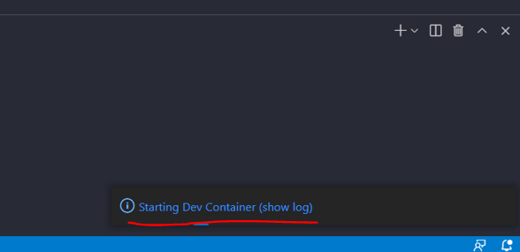
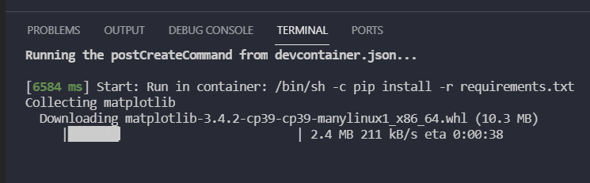
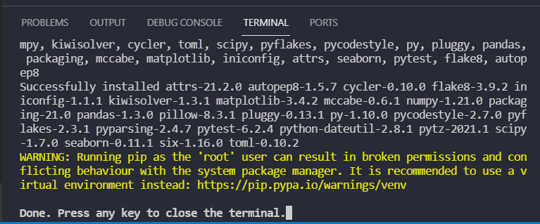
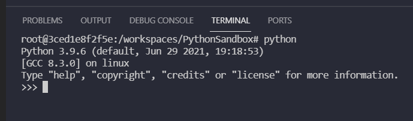
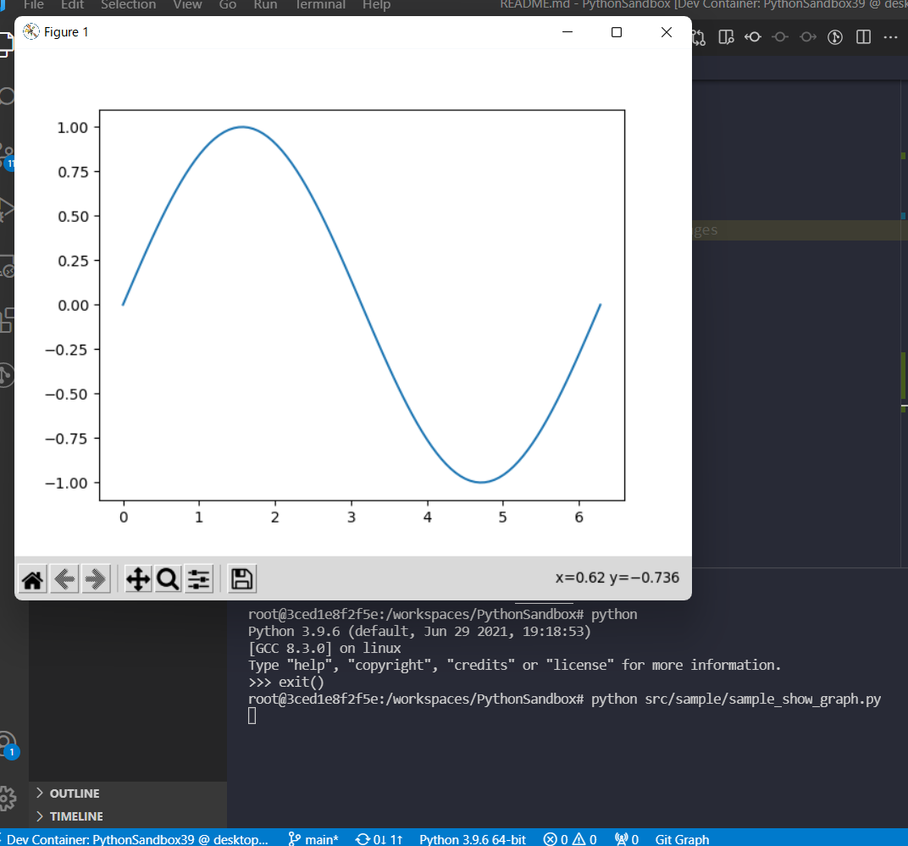

# PythonSandbox
Python virtual environment with Docker

## Environment
Windows  
[Docker Desktop for Windows](https://hub.docker.com/editions/community/docker-ce-desktop-windows/)  
[Visual Stdio Code](https://azure.microsoft.com/ja-jp/products/visual-studio-code/)  
[Remote-Containers](https://marketplace.visualstudio.com/items?itemName=ms-vscode-remote.remote-containers)  
[VcXsrv](https://sourceforge.net/projects/vcxsrv/)  

## Python version
3.9.6

## Python libraries
matplotlib  
numpy  
seaborn  
pandas  
flake8  
autopep8  
pytest  

## How to use
### 1. Launch VcXsrv
execute xlaunch.exe  
  
  
  
  

### 2. Open root directory with VSCode
Open root directory of this repository with VSCode  
  

### 3. Open folder in container  
Click the following icon  
  

When you open for the first time, select "Open Folder in Container"  
  

Select this repository's folder  
  

### 4. Build container
Building container will start  
  

After buidling, installing python libraries will start  
  

Installation will finish as follow  
  

### 5. Confirmation
Open terminal and confirm Python's version  
  

Execute sample code  
The following graph window will be shown  
  